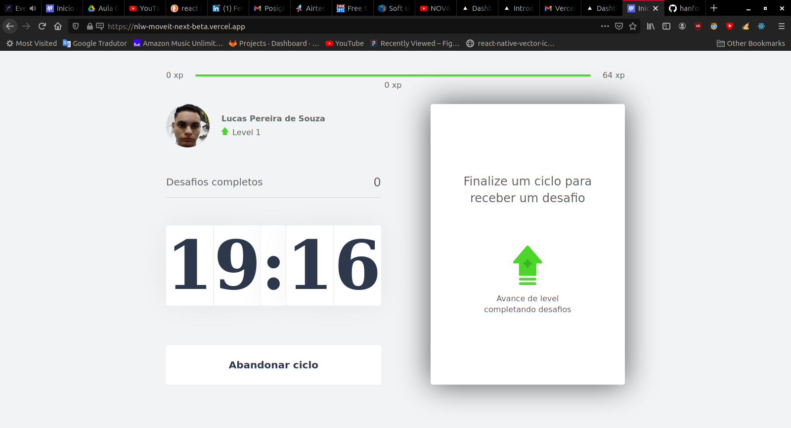
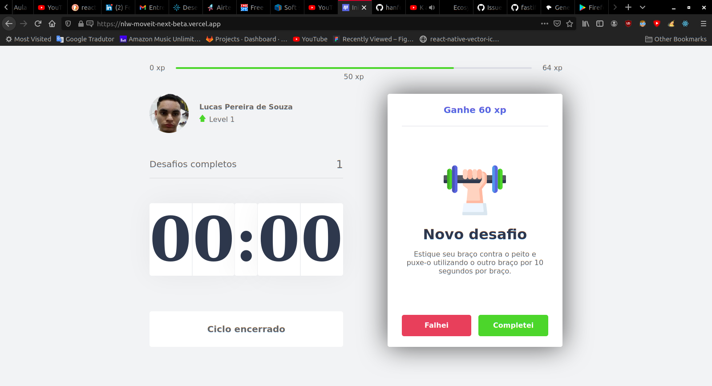
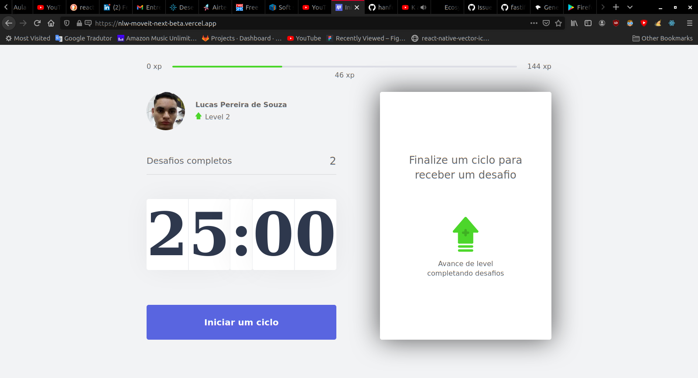
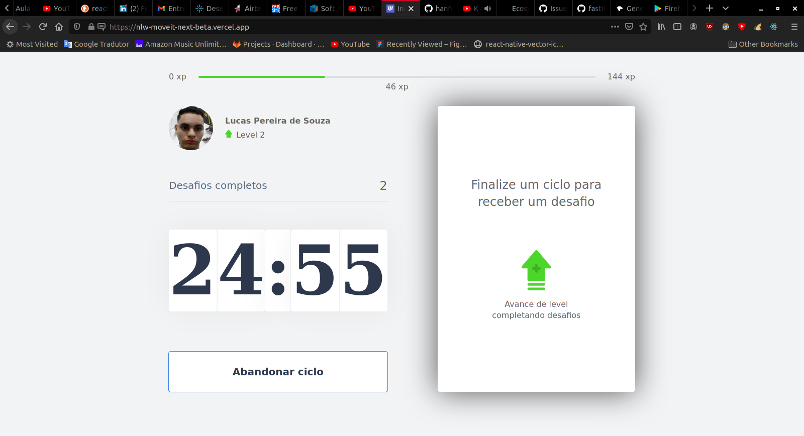

# Test Livelo - Dados do Star Wars

## Introdução

> Projeto criado durante a nlw edição#04 onde foi criado o projeto utilizando o next com tecnologias como a context api para o controle dos estados do site,
> cokies para salvar offline para não se perder os estados do site e web apis como Notification e Audio
> Ele está hospedado no vercel com a url `https://nlw-moveit-next-beta.vercel.app/`

## Instalação

> Para fazer a intalação utilize o `npm install ` ou `yarn`
> e para rodar `npm run dev`

versões utilizadas

npm: 7.5.4
node: 15.8.0

